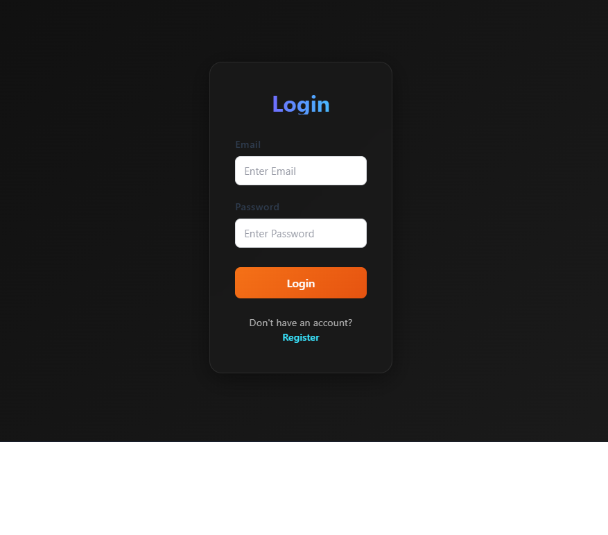
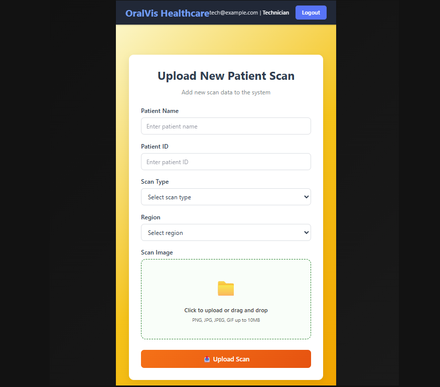
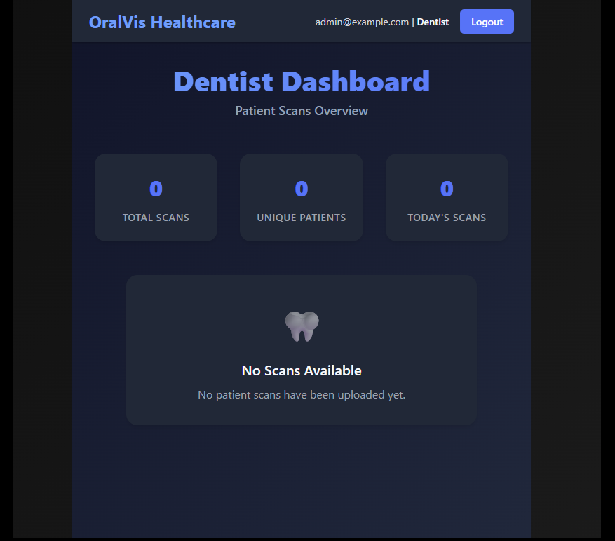
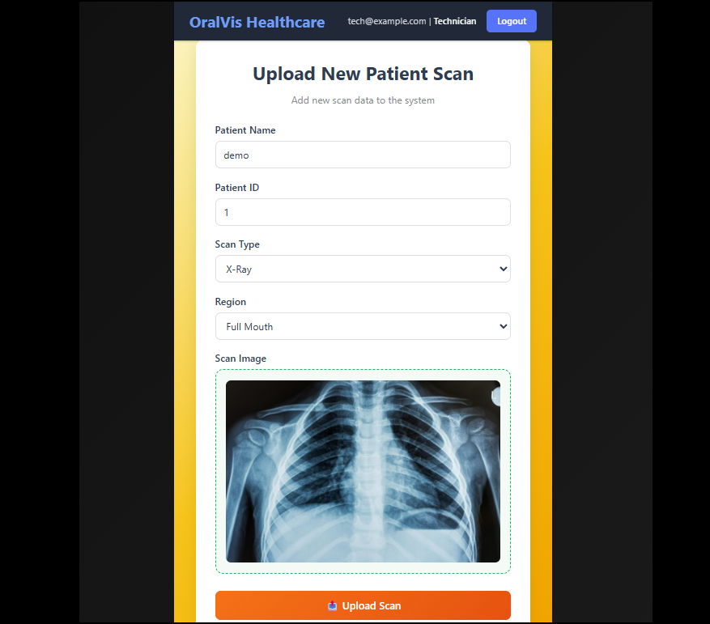

# OralVis Healthcare - Oral Health Visualization Platform

A comprehensive web application for managing and visualizing oral health scans, designed for seamless collaboration between dental technicians and dentists.

## 🚀 Live Demo

**Frontend:** [https://oralvis-healthcare.netlify.app](https://oralvis-healthcare.netlify.app)
**Backend API:** [https://oralvis-healthcare-assignment.onrender.com](https://oralvis-healthcare-assignment.onrender.com)

## 📋 Test Credentials

### Technician Account
- **Email:** `tech@example.com`
- **Password:** `tech123`

### Dentist Account
- **Email:** `admin@example.com`
- **Password:** `admin123`

## 🛠️ Technology Stack

### Frontend
- **React 18** - UI Library
- **React Router DOM** - Client-side routing
- **Vite** - Build tool and development server
- **CSS3** - Modern responsive styling
- **Axios** - HTTP client
- **js-cookie** - Cookie management
- **jsPDF** - PDF report generation

### Backend
- **Node.js** - Runtime environment
- **Express.js** - Web framework
- **SQLite** - Database
- **JWT** - Authentication
- **Multer** - File upload handling
- **Cloudinary** - Image storage
- **bcryptjs** - Password hashing
- **CORS** - Cross-origin resource sharing

### Deployment
- **Frontend:** Netlify
- **Backend:** Render
- **Database:** SQLite (persistent on Render)
- **File Storage:** Cloudinary

## 📸 Screenshots

### Login Page


### Technician Upload Interface


### Dentist Dashboard


### Scan Details Modal


## 🏃‍♂️ Running Locally

### Prerequisites
- Node.js (v16 or higher)
- npm or yarn
- Git

### 1. Clone the Repository
```bash
git clone https://github.com/yourusername/oralvis-healthcare.git
cd oralvis-healthcare
```

### 2. Backend Setup

```bash
# Navigate to backend directory
cd oralvis-backend

# Install dependencies
npm install

# Create environment file
cp .env.example .env

# Edit .env with your configuration
# Start the backend server
npm start
```

The backend will run on `http://localhost:5000`

### 3. Frontend Setup

```bash
# Navigate to frontend directory (in new terminal)
cd oralvis-frontend

# Install dependencies
npm install

# Create environment file
cp .env.example .env

# Edit .env with backend URL
# Start the frontend server
npm run dev
```

The frontend will run on `http://localhost:3000`

## ⚙️ Environment Configuration

### Backend (.env)
```env
PORT=5000
JWT_SECRET=your_super_secure_jwt_secret_key_here
JWT_EXPIRES_IN=24h
CLOUDINARY_CLOUD_NAME=your_cloudinary_name
CLOUDINARY_API_KEY=your_cloudinary_key
CLOUDINARY_API_SECRET=your_cloudinary_secret
FRONTEND_URL=http://localhost:3000
NODE_ENV=development
```

### Frontend (.env)
```env
VITE_API_URL=http://localhost:5000
```

### Production Environment Variables

#### Backend (Render)
```env
PORT=10000
JWT_SECRET=your_super_secure_jwt_secret_key_here
JWT_EXPIRES_IN=24h
CLOUDINARY_CLOUD_NAME=your_cloudinary_name
CLOUDINARY_API_KEY=your_cloudinary_key
CLOUDINARY_API_SECRET=your_cloudinary_secret
FRONTEND_URL=https://oralvis-healthcare.netlify.app
NODE_ENV=production
```

#### Frontend (Netlify)
```env
VITE_API_URL=https://oralvis-healthcare-assignment.onrender.com
```

## 🔧 Build for Production

### Frontend
```bash
cd oralvis-frontend
npm run build
```

### Backend
```bash
cd oralvis-backend
npm start
```

## 🌟 Features

### For Technicians
- **Secure Authentication** - JWT-based login system
- **Scan Upload** - Upload patient scans with metadata
- **File Management** - Support for multiple image formats
- **Form Validation** - Comprehensive input validation

### For Dentists
- **Dashboard Overview** - View all uploaded scans
- **Patient Statistics** - Real-time scan analytics
- **Scan Viewer** - Full-screen image viewing
- **PDF Reports** - Generate downloadable patient reports
- **Search & Filter** - Find specific patient scans

### General
- **Responsive Design** - Works on all devices
- **Modern UI/UX** - Clean, professional interface
- **Real-time Updates** - Live data synchronization
- **Secure Storage** - Cloudinary integration for images
- **Role-based Access** - Different interfaces for different roles

## 🔒 Security Features

- JWT token authentication
- Password hashing with bcrypt
- CORS protection
- Input validation and sanitization
- Secure file upload handling
- Environment variable protection

## 📱 Responsive Design

The application is fully responsive and optimized for:
- **Desktop** (1024px+)
- **Tablet** (768px - 1023px)
- **Mobile** (320px - 767px)

## 🚀 Deployment

### Frontend (Netlify)
1. Build the project: `npm run build`
2. Deploy the `dist` folder to Netlify
3. Configure environment variables in Netlify dashboard:
   - `VITE_API_URL=https://oralvis-healthcare-assignment.onrender.com`
4. Add `netlify.toml` for SPA routing:
   ```toml
   [[redirects]]
     from = "/*"
     to = "/index.html"
     status = 200
   ```

### Backend (Render)
1. Create Web Service on Render
2. Connect GitHub repository to Render
3. Set build command: `npm install`
4. Set start command: `npm start`
5. Set root directory: `oralvis-backend` (if monorepo)
6. Configure environment variables in Render dashboard
7. Deploy and get your service URL

**Important:** Render is required for the backend as it supports SQLite databases, unlike Vercel which is serverless.

## 🤝 Contributing

1. Fork the repository
2. Create a feature branch (`git checkout -b feature/AmazingFeature`)
3. Commit your changes (`git commit -m 'Add some AmazingFeature'`)
4. Push to the branch (`git push origin feature/AmazingFeature`)
5. Open a Pull Request

## 📄 License

This project is licensed under the MIT License - see the [LICENSE](LICENSE) file for details.

## 👥 Team

- **Developer:** Your Name
- **Project Type:** Healthcare Technology
- **Duration:** Development Timeline

## 📞 Support

For support, email support@oralvis.com or create an issue in the GitHub repository.

---

**Made with ❤️ for better oral healthcare management**